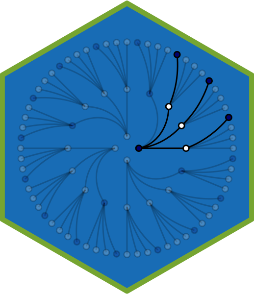

# DSBA 6010 / STAT 7027: Bayesian Statistics (Special Topics in DSBA / STAT) 

This repository contains the code for generating [dsba6010-spring2022.netlify.app](https://dsba6010-spring2022.netlify.app).

